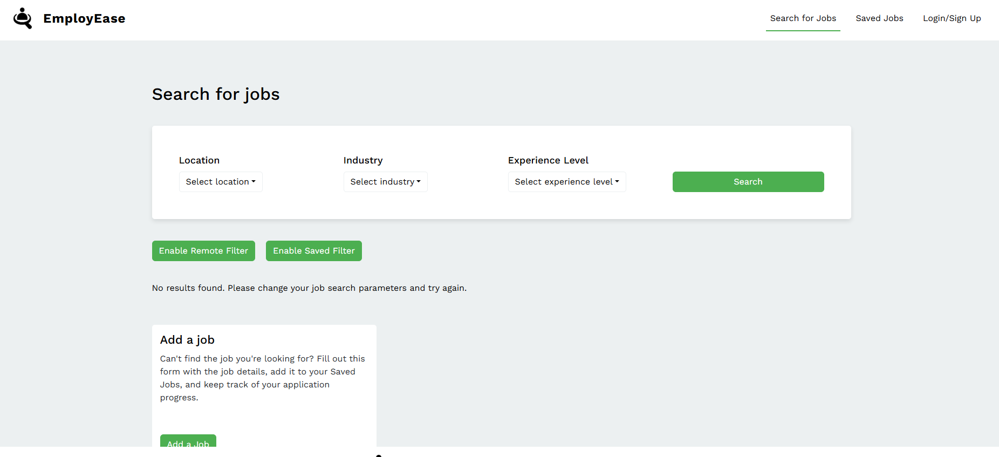
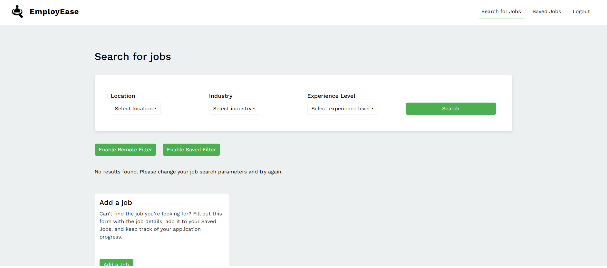
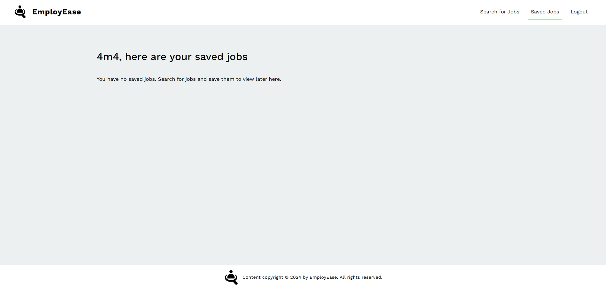
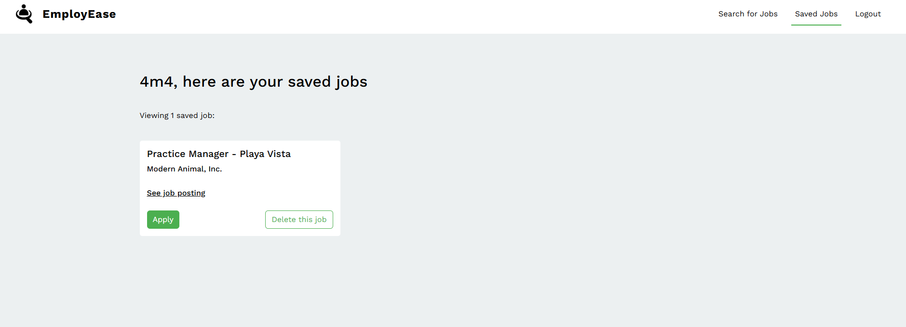

# Employease

Visit us at => https://employease-hubi.onrender.com/

[](https://opensource.org/licenses/MIT)


## Description
job search and application tracker

## Table of Contents
* [Installation](#installation)
* [Usage](#usage)
* [License](#license)
* [GitHub](#github)
* [Questions](#questions)

## Installation
#### If you want the code used to create this application:
1. **Clone the Repository**:
   Open your terminal and run the following command to clone the repository to your local machine:

   ```bash
   git clone https://github.com/ChristopherP-C/EmployEase

2. **Navigate to the Project Directory** :

    ```bash
    cd your-repo-name
3. **Install Dependencies**: 

  "packages": {
    "": {
      "name": "employease",
      "version": "1.0.0",
      "hasInstallScript": true,
      "license": "ISC",
      "dependencies": {
        "@testing-library/react": "^16.1.0",
        "apollo-server-express": "^3.13.0",
        "dompurify": "^3.2.3",
        "happy-dom": "^15.11.7",
        "vitest": "^2.1.8"
      },
      "devDependencies": {
        "@testing-library/jest-dom": "^6.6.3",
        "@types/jest": "^29.5.14",
        "concurrently": "^8.2.0"
      }
    },
  }

4. **Run the Application**: 
    You can now run the application by executing the following command:
    ```bash
    npm run build
    npm run develop

## Usage
This application is accessible in two ways:

1. **Locally**: Clone the repository, install the necessary dependencies, and run the application from the command line.
2. **Deployed Version**: Visit the live version of the application here: [EmployEase](https://employease-hubi.onrender.com/).


**Here, you can see what the Landing Page looks like when you open the application:**


**Here, you can see what the Login Page looks like:**


**Here, you can see what the Sign Up page looks like:**


**Here, you can see what the Home page looks like:**


**Here, you can see what the Saved Events page looks like:**




## License
This project is licensed under the MIT license.


* [License](https://opensource.org/license/mit)

## GitHub
**The contributors to this project are listed below. Click any name to visit their GitHub page:** <br>
[Avery Jacobson](https://github.com/TheReal4m4d3u5)
<br>

[Cheyenna Raelynn Bjorklund](https://github.com/)
<br>

[Chris Persaud-Cox](https://github.com/ChristopherP-C)

<br>

[Jayce Thoreson](https://github.com/)


## Questions
If you have any questions reguarding this application, feel free to reach out to any of the contributors of the project. Contact info can be found on each individuals GitHub page (listed above).

## Credits and Acknnowledgements
- **University of Minnesota** — For providing foundational resources, guidance, and support throughout the development of this project.
- **[Node.js](https://nodejs.org/en)** — For its powerful runtime environment that allowed for efficient and scalable JavaScript development on the server side.
- **Vite** — For its fast and flexible build tool, which greatly enhanced our development workflow with rapid bundling and efficient hot reloading.
- **[TheMuse API](https://www.themuse.com/developers/api)** — For supplying jobs

- **Render** — For a seamless and reliable deployment platform, making it easy to host, manage, and scale the application.
- **Atlas** — For its scalable and developer-friendly database solution, supporting robust data storage and retrieval for mongo databases.
- **[Bootstrap](https://getbootstrap.com/)** - Open-source front-end framework

Thanks!
